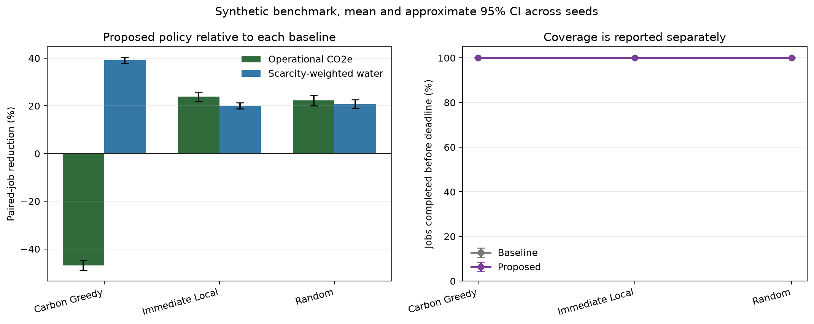
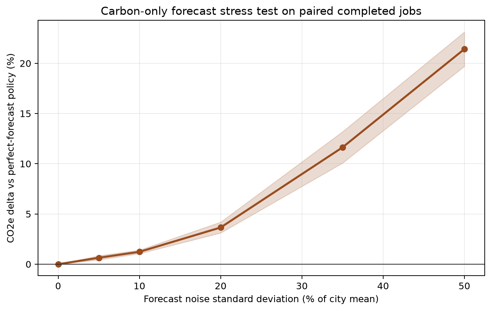
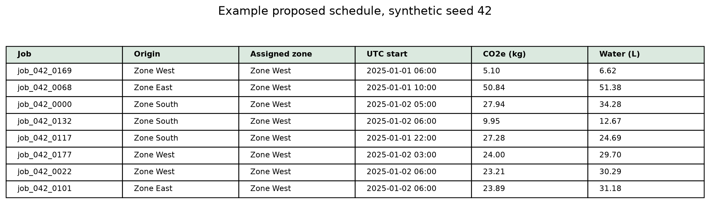

# Results and Output Guide

## Run configuration

The committed artifacts were regenerated with:

```bash
python -m src.experiments --seeds 10 --jobs 180 --hours 168
```

The seed range is 42 through 51. The proposed weights are 0.55 for carbon,
0.35 for scarcity-weighted water, and 0.10 for relocation. The configuration is
also recorded in `results/run_metadata.json`.

## Main result

All four policies completed 100% of submitted jobs for all 10 seeds. Paired
comparisons therefore contain 180 jobs per seed and an average of 19,073.6 kWh
of common IT work.

| Baseline | CO2e reduction | Physical water reduction | Scarcity-weighted water reduction | Proposed coverage | Baseline coverage |
|---|---:|---:|---:|---:|---:|
| Immediate local | 23.94% (CI 1.92) | 28.60% (CI 1.89) | 20.08% (CI 1.28) | 100% | 100% |
| Random feasible | 22.31% (CI 2.18) | 29.50% (CI 2.81) | 20.78% (CI 1.87) | 100% | 100% |
| Carbon greedy | -46.88% (CI 2.11) | 52.75% (CI 1.47) | 39.17% (CI 1.17) | 100% | 100% |

A negative reduction means the proposed policy used more operational CO2e. In
this benchmark, the balanced policy used 46.88% more CO2e than carbon greedy.
This is expected because carbon greedy ignores water and relocation. The result
shows that the objectives conflict and that the chosen weights matter.



## Forecast stress test

The robustness study uses a carbon-only policy so the reference and noisy policy
optimize the same objective. It evaluates every hour of every scheduled job with
realized intensity and PUE.

| Noise standard deviation | Forecast RMSE | CO2e delta vs perfect forecast | Paired jobs | Coverage |
|---:|---:|---:|---:|---:|
| 0% | 0.0000 | 0.00% (CI 0.00) | 180 | 100% |
| 5% | 0.0169 | 0.64% (CI 0.21) | 180 | 100% |
| 10% | 0.0342 | 1.23% (CI 0.17) | 180 | 100% |
| 20% | 0.0684 | 3.65% (CI 0.54) | 180 | 100% |
| 35% | 0.1196 | 11.63% (CI 1.56) | 180 | 100% |
| 50% | 0.1681 | 21.42% (CI 1.71) | 180 | 100% |



## Example output

The schedule CSV keeps the submitted job fields, assignment, timestamps,
normalized decision score, physical impacts, relocation flag, completion flag,
and failure reason. Unscheduled jobs are never dropped.



## Artifact files

| File | Level | Interpretation |
|---|---|---|
| `results/policy_summary_by_seed.csv` | Policy and seed | Coverage, total impacts, and relocation rate |
| `results/paired_comparisons_by_seed.csv` | Baseline and seed | Equal-work environmental comparison |
| `results/benchmark_summary.csv` | Baseline aggregate | Mean and approximate 95% CI across seeds |
| `results/forecast_robustness.csv` | Noise level aggregate | Forecast RMSE, realized carbon delta, coverage, and paired jobs |
| `results/example_schedule.csv` | Job | Auditable assignment output for seed 42 |
| `results/run_metadata.json` | Run | Benchmark version, parameters, weights, and claim scope |
| `results/SHA256SUMS` | Run | SHA-256 digests for generated tables, metadata, and figures |

## Interpretation boundary

The benchmark is designed to test code and methodology. It is not calibrated to
a real data center fleet. The percentages must not be used in a sustainability
report, investment case, or operational forecast without replacing synthetic
inputs and validating the full system boundary.
